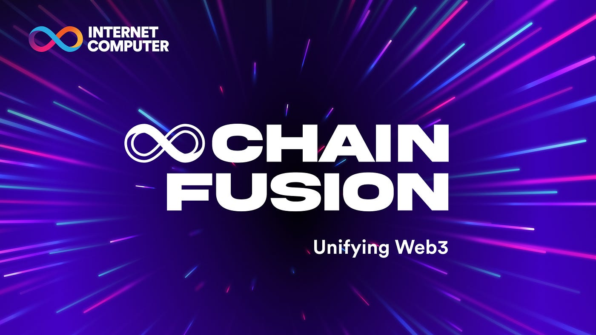

<br/>
<br/>

[](https://internetcomputer.org)
[](https://github.com/dfinity/chain-fusion-signer/actions/workflows/check.yml)

</div>

---

# What is the Chain Fusion Signer

The Internet Computer provides an API that allows any canister to hold decentralised public-private key pairs. These keys can be used to sign messages for any system that uses compatible elliptic curves. Popular use cases are signing Bitcoin and Ethereum transactions. However, accessing this API requires developing a backend canister, which may be an unnecessary hurdle. The Chain Fusion Signer makes the Internet Computer threshold signature APIs directly accessible to web apps and to command line users.

## Use Cases

### Front-end application development

A front end web developer can now develop a multi-chain web app using the following generic components:

- An asset canister, for serving HTML, images and Javascript.
- An identity provider for login.
- The Chain Fusion Signer to interact with blockchains.
- A generic data store for user profiles; developers have a wide choice of SQL and NoSQL databases that run on the Internet Computer.

### Command Line

Users can now hold keys on-chain and sign with the command line with a simple `dfx canister call`, without having to deploy or maintain their own signing canister.

Example: Sign an Ethereum transaction hash. The same calls may be used when signing in a web page.

```
CHAIN_FUSION_SIGNER="grghe-syaaa-aaaar-qabyq-cai"
CYCLES_LEDGER="um5iw-rqaaa-aaaaq-qaaba-cai"

# Approve payment; I typically make a few large approvals rather than a separate approval for each API call:
dfx canister call "$CYCLES_LEDGER" icrc2_approve --ic "
  record {
    amount = 1_000_000_000_000;
    spender = record {
      owner = principal \"${CHAIN_FUSION_SIGNER}\";
    };
  }" >/dev/null

# Make some calls, e.g. sign a transaction hash:
dfx canister call "$CHAIN_FUSION_SIGNER" generic_sign_with_ecdsa --ic '
(
  opt variant { CallerPaysIcrc2Cycles },
  record {
    key_id = record { name = "key_1"; curve = variant { secp256k1 } };
    derivation_path = vec { blob "my_eth_keys"; blob "my_first_key" };
    message_hash = blob "\41\40\f0\a8\8b\3e\ea\41\5c\d2\77\4f\c2\70\f1\6b\51\2c\7c\63\7e\9b\54\2a\31\35\96\8b\ac\b1\47\ae";
  },
)
'
```

# Governance

### Ownership

The Chain Fusion Signer is intended to have ownership equivalent to the Internet Computer threshold signing APIs. The purpose of the Chain Fusion Signer is ONLY to make the Internet Computer signing APIs more accessible.

### Payment

Threshold signatures require cycles. As such, API users must attach cycles for their calls, either directly or via a payment protocol.

### Update Cadence

The chain fusion signer is made to be very stable. It would be black-holed but the requirement to be able to make security updates precludes that. However, after an initial teething phase, updates should be very rare and performed only with strong community support, similar to the support required to add the threshold signing APIs in the first place. Upgrade should occur ONLY when:

- There is a security flaw that needs to be addressed.
- The Internet Computer threshold signing APIs change. For example, if the Internet Computer adds support for an additional elliptic curve, the Chain Fusion Signer should make that improvement available to web developers.
- In very limited cases, utilities may be added to the Chain Fusion Signer to support common use cases. Restraint should be exercised here. Convenience functions that can be implemented in the browser should be implemented in the browser. Convenience functions should address only very common, well established use cases.

### Maintenance

The Chain Fusion Signer code should be very simple and maintainable, so that any developer with a strong record of making trustworthy, secure cryptographic applications can maintain it.

Any developer who wishes to make changes to the Chain Fusion Signer SHOULD:

- Communicate with the community, e.g. via the forums, to verify that their intended changes have support.
- Communicate with other maintainers, to ensure that changes do not conflict.
- Submit changes in small units, ideally of under 100 lines per change.
- Ensure that a well known and trusted auditor checks the code.

### License

Please see the [LICENSE](LICENSE) and [Contribution guidelines](CONTRIBUTING.md).

### Verifiability

The code can be built reproducibly with:

```
./scripts/docker-build
```

# Usage

Please refer to the canister .did file to the API.

TODO: Examples and developer-friendly documentation.
